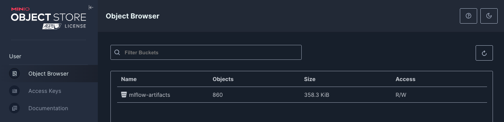
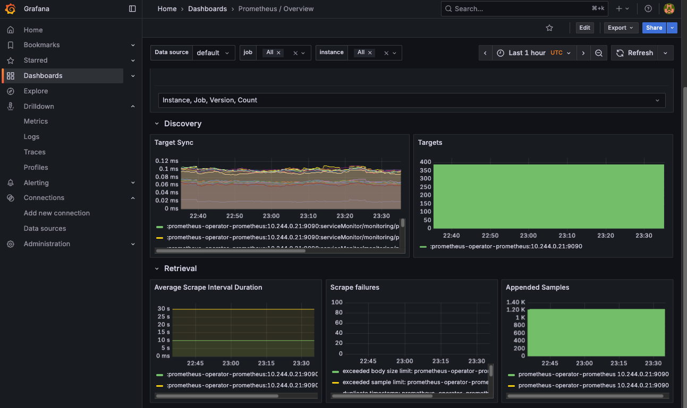
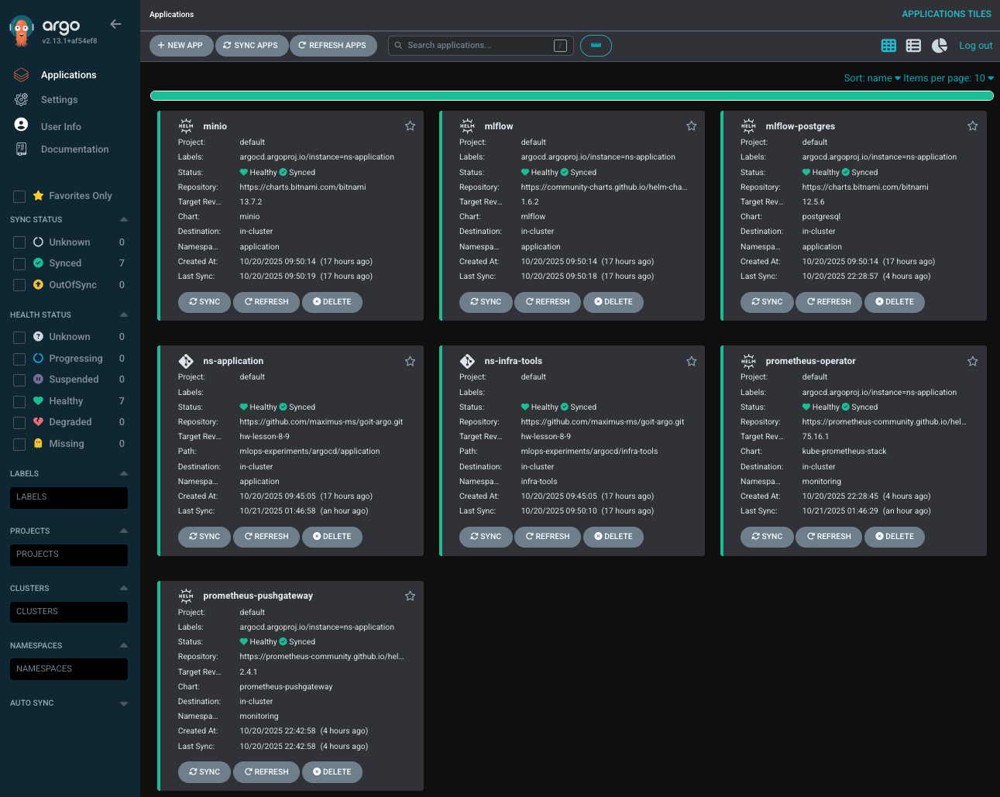
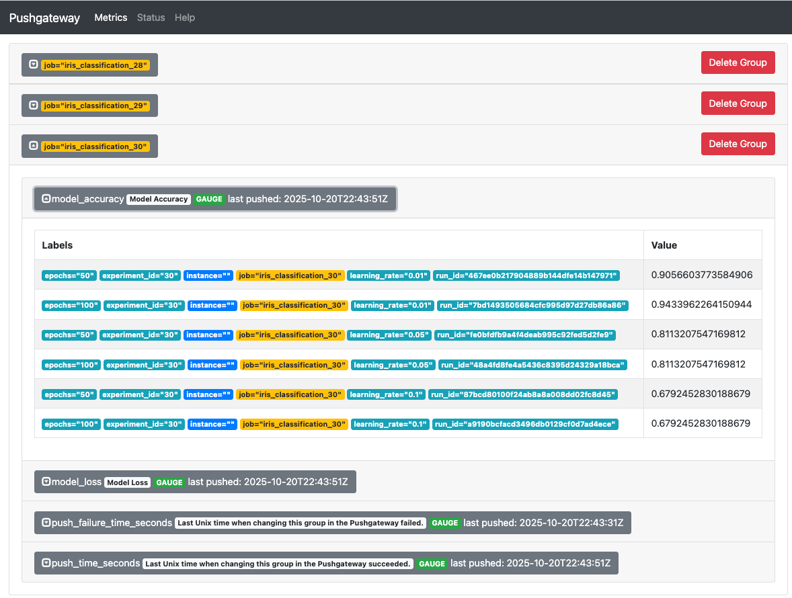
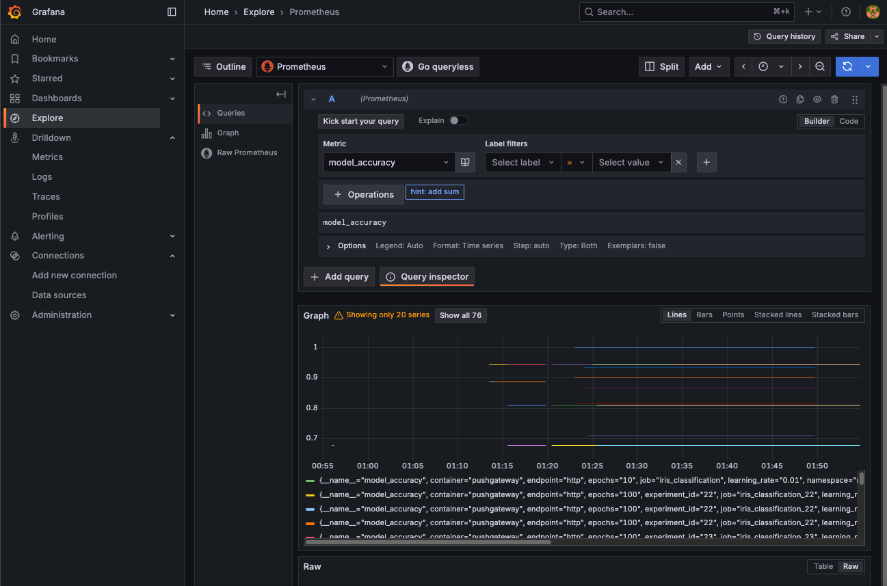
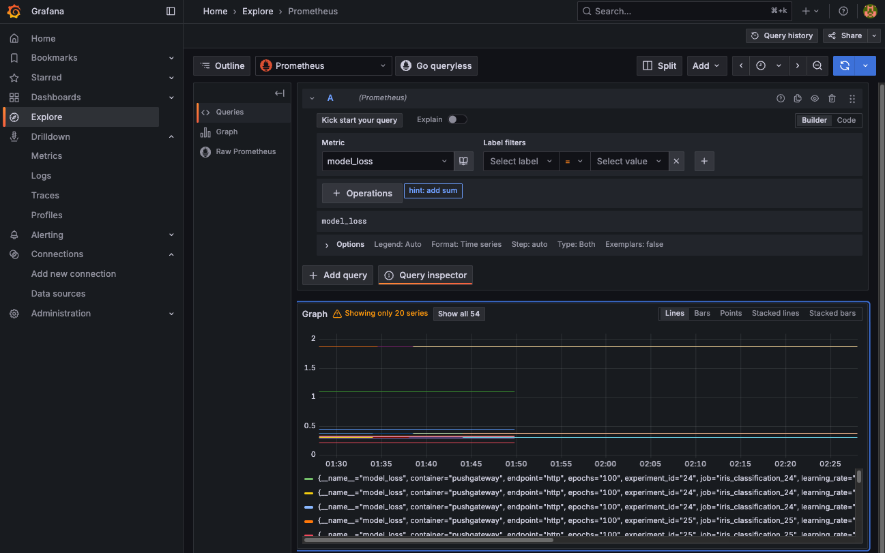

# HW-9 "Моніторинг якості моделей та відстеження експериментів"

## 🎯 Мета
 - Провести трекінг ML-експериментів через MLflow;
 - Логувати параметри, метрики, артефакти;
 - Автоматично вибрати кращу модель;
 - Вивести ключові метрики експерименту в Grafana через PushGateway;
 - Розгорнути всі сервіси декларативно через ArgoCD.


## Підключення до K8s кластера

В цій роботі було вирішено використати `minikube` замість `AWS`. Це додасть більше практичного досвіду у роботі з різними іниструментами.

1. Отримуємо список доступних конфігурацій у `kubectl`
```bash
kubectl config get-clusters
```
2. Активуємо локальний minicube конфіг (імʼя конфігу беремо з виводу попередньої команди)
```bash
kubectl config use-context amd2-minikube
```
3. Перевіряємо наявність нодів
```bash
kubectl get nodes
```
Бачимо вивід команди:
```
NAME       STATUS   ROLES           AGE     VERSION
minikube   Ready    control-plane   3h17m   v1.34.0
```
K2s кластер піднятий і підлючений до `kubectl`, все готово до подальшої роботи.

## 1. Завдання: Розгорніть MLflow-інфраструктуру через ArgoCD

Маємо файли з конфігураціями ArgoCD:
 - [minio.yaml](./argocd/application/minio.yaml) для MinIO з bucket mlflow-artifacts;
 - [postgres.yaml](./argocd/application/postgres.yaml) для PostgreSQL з базою mlflow;
 - [mlflow.yaml](./argocd/application/mlflow.yaml) для MLflow Tracking Server (ClusterIP, порт 5000).

Прокинемо порти і перевіримо, що все працює
```bash
kubectl port-forward svc/argocd-server -n infra-tools 8080:80
```
```bash
kubectl port-forward svc/minio 9000 -n applicatio
kubectl port-forward svc/minio 9001 -n applicatio
```



```bash
kubectl port-forward svc/mlflow 5000 -n application
```


## 2. Завдання: Розгорніть Prometheus PushGateway через ArgoCD

Спочатку піднімемо Prometheus+Grafana в неймспейсі `monitoring`. Маємо файл з відповідною апплікацією.
 - [prometheus.yaml](./argocd/application/prometheus.yaml)

А також прокидуємо порт і перевіряємо роботу сервісів в браузері
```bash
kubectl port-forward svc/prometheus-operator-grafana 3000:80 -n monitoring
```


Тепер піднімаємо PushGateway. Маємо файл з конфігураціями ArgoCD:
 - [pushgateway.yaml](./argocd/application/pushgateway.yaml)

Пробросимо порт, то ж з застосунку ми зможемо "дістатися" до `PushGateway` за адресою `http://localhost:9091`
```bash
kubectl port-forward svc/prometheus-pushgateway 9091 -n monitoring
```

Перевіряємо в `ArgoCD` що сервіс працює



## 3. Завдання: Напишіть Python-скрипт train_and_push.py

**Скрипт повинен:**

- Завантажити датасет (наприклад, "Iris");
- Пройти цикл тренувань із різними параметрами (`learning_rate`, `epochs`);
- Для кожного запуску:
    - Логувати параметри та метрики в `MLFlow`;
    - Зберігати модель як артефакт;
    - Пушити `accuracy` та `loss` у `PushGateway` з мітками `run_id`;
- Після завершення:
    - Знайти запуск із найкращою `accuracy`;
    - Скопіювати модель у локальну директорію `best_model/.`


Маємо [python-скрипт](./experiments/train_and_push.py) та [requirements.txt](./experiments/requirements.txt).

***Памʼятка: Подальщі команди виконуємо з директорії з файлами експеримента `./experiments`***

Створимо віртуальне середовище і в ньому встановимо всі залежності
```bash
python3 -m venv .venv
source .venv/bin/activate
pip install -r requirements.txt
```
Також перед запуском скрипта створимо наш `.env` файл. Для референсу беремо необхідні імена змінних середовищя з файлу [.env_example](./experiments/.env_example).

Запускаємо скрипт
```bash
python ./train_and_push.py
```
```
...
Реєстрація найкращої моделі в MLflow...
* Найкраща модель: SGDClassifier(eta0=0.01, learning_rate='constant', loss='log_loss',
              max_iter=100, random_state=42)
* Найкраща точність: 0.9433962264150944
...
Created version '9' of model 'iris_classifier'.
✅ Модель успішно зареєстрована в MLflow Model Registry
📊 Model URI: models:/m-8689a3481fb64bbe927b12998d2143fa
🔗 Для доступу до моделі: mlflow.sklearn.load_model('models:/m-8689a3481fb64bbe927b12998d2143fa')
🏃 View run Best Model Registration at: http://localhost:5000/#/experiments/32/runs/003d0783acf5485fbb70ae32054f216a
🧪 View experiment at: http://localhost:5000/#/experiments/32
```

Переглянемо результати виконання скрипта в `MLFlow`


## 4. Завдання: Перегляньте метрики в Grafana

Спочатку перевіримо записи в самому `PushGateway` через веб-інтерфейс



Далі відкриємо `Grafana` за адресою [http://localhost:3000/](http://localhost:3000) (раніше ми прокидували порт) і в розділі `Explore → Prometheus` витягуємо метрики, що ми відправляли в `PushGataway`.

Метрика `model_accuracy`



Метрика `model_loss`



