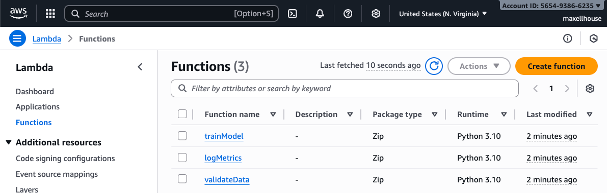
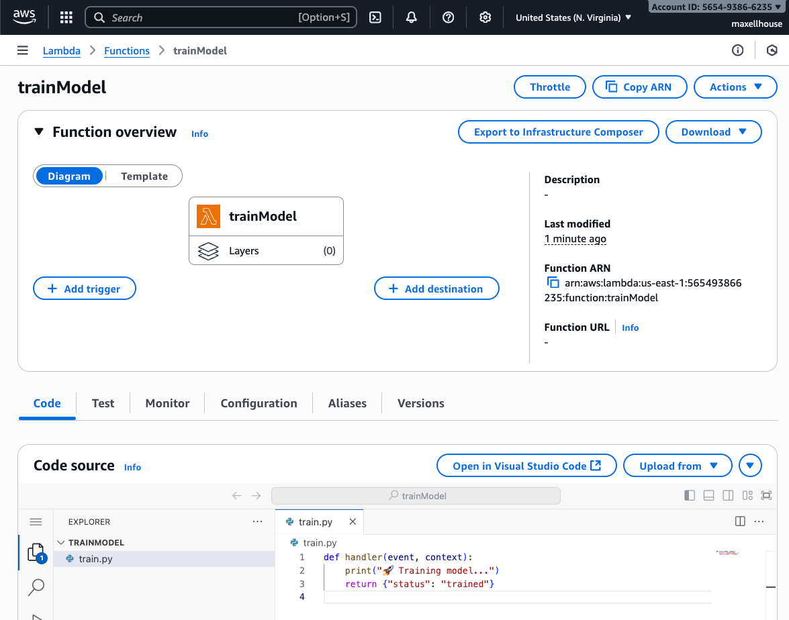
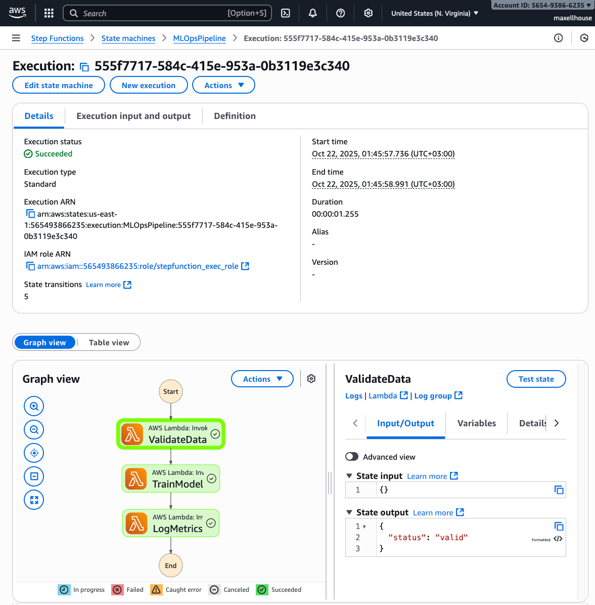
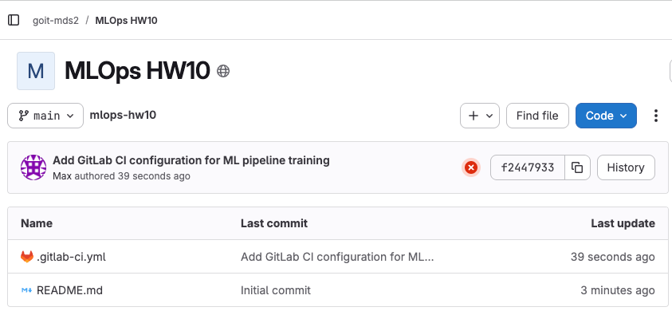
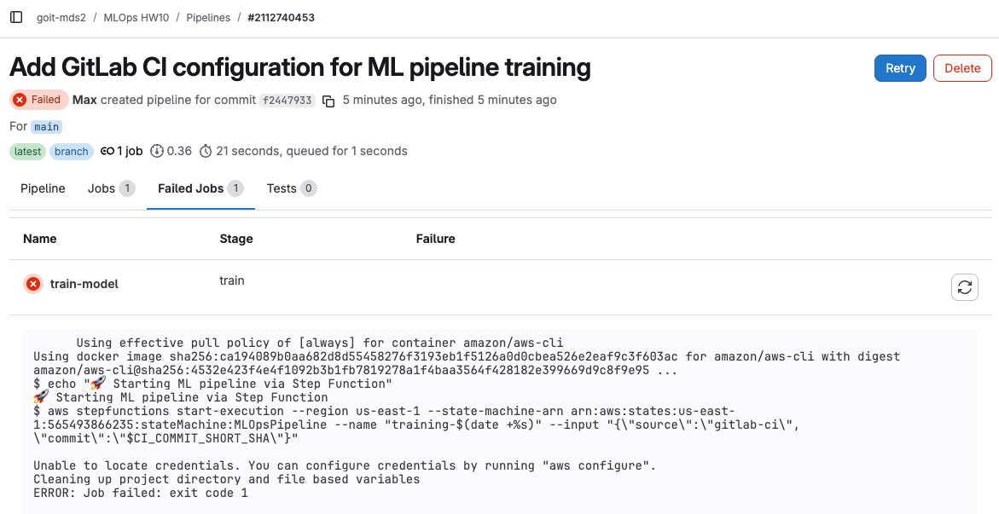
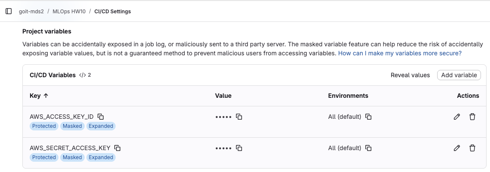
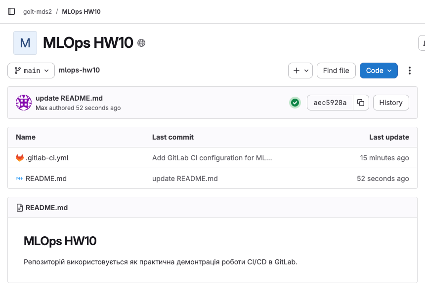
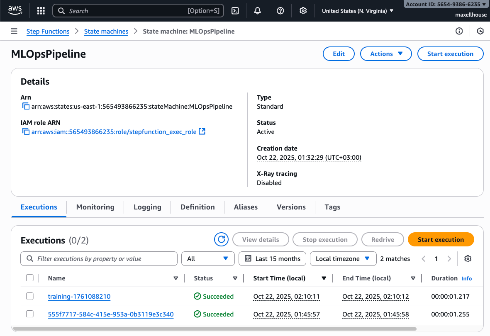
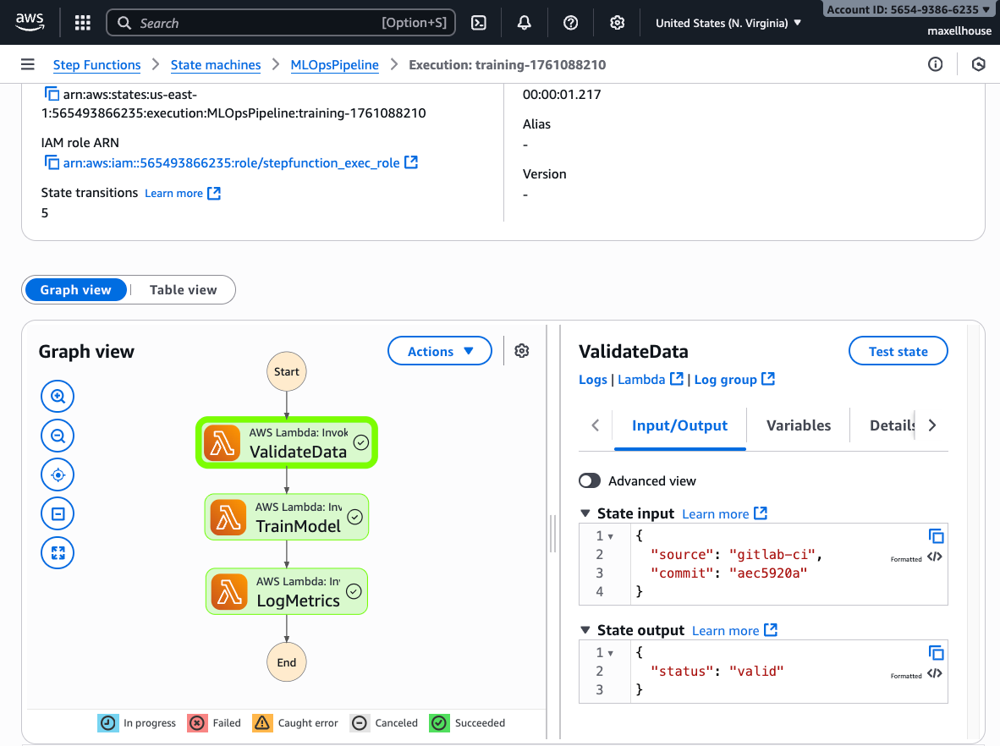

# HW-10 "Автоматизоване тренування моделей"

## 🎯 Мета
- Створити Step Function в AWS, яка запускає пайплайн тренування з кількох кроків;
- Створити Lambda-функції для окремих етапів (наприклад, валідація та логування);
- Розгорнути інфраструктуру через Terraform;
- Налаштувати GitLab CI для автоматичного запуску Step Function при push.


## 1. Завдання: Створити Lambda-функції

Створено відповідні файли:
- [validate.py](./terraform/lambda/validate.py)
- [train.py](./terraform/lambda/train.py)
- [log_metrics.py](./terraform/lambda/log_metrics.py)

А також відповідні архіви:
```bash
zip log_metrics.zip log_metrics.py
zip train.zip train.py
zip validate.zip validate.py
```
Тож маємо файли в директорії `./terraform/lambda`
```bash
log_metrics.py
log_metrics.zip
train.py
train.zip
validate.py
validate.zip
```

## 2. Завдання: Написати Terraform конфігурацію

Маємо файл з `Terrarorm` конфігурацією
-  [main.tf](./terraform/main.tf)

Запуск створення інфраструктури в `AWS` задопомогою `Terraform`
```bash
terraform init
terraform apply
```

### Перевіримо створені ресурси на AWS

Загальний список лямбда-функцій



Переглянемо функцію `trainModel`



Відкриємо нашу step-функцію `MLOpsPipeline`


Пробуємо запустити пайплайн вручну і перевіримо що все працює. Звертаємо увагу, що `State input` в даному випадку пустий.



## 3. Завдання: Налаштувати GitLab CI

Маємо файл для конфігурації CI/CD в 
- [.gitlab-ci.yml](./.gitlab-ci.yml)

Створимо [GitLab репозиторій](https://gitlab.com/goit-mds2/mlops-hw10) і запушимо в нього цей файл.

В репозиторії бачимо, що одразу нам додався пайплайн, але він завершився з помилкою



Причина помилки: відсутність ключів доступу до AWS



Тому додаємо змінні `AWS_ACCESS_KEY_ID`, `AWS_ACCESS_KEY_ID` до проєкту



Пушаємо ще одни коміт в `GitLab` репозиторій і перевіряємо роботу CI/CD



Перевіряємо результати роботи на AWS, бачимо 2 запуски нашого пайплайну. Перший, той що ми робили вручну одразу після створення. Другий - автоматично запущений з GitLab.



Відкриємо детальну інформацію про запуск що було ініційовано автоматично і перевіримо його вхідні параметри.

